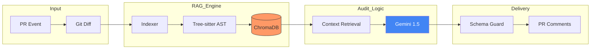

# SentinelPR: Context-Aware AI Code Auditor

   

**SentinelPR** is a deterministic, context-aware code review agent designed for high-velocity engineering teams. Unlike standard LLM wrappers that hallucinate on raw diffs, SentinelPR leverages **Concrete Syntax Tree (CST) parsing** and **Retrieval-Augmented Generation (RAG)** to understand the *full semantic scope* of your changes.

It doesn't just read the lines that changed, but reads the functions you modified, retrieves similar patterns from your codebase, and validates every suggestion against the actual Git diff hunks.

---

## Why SentinelPR?

Most AI reviewers are **Context-Blind**. They see a 5-line diff and guess the intent. **SentinelPR is Context-Aware.**

| Feature | Standard AI Reviewer | SentinelPR |
| :--- | :--- | :--- |
| **Parsing Engine** | Regex / Text Splitting | **Tree-sitter CST** (Compiler-Grade) |
| **Context Window** | The Diff Only | **Full Symbol Scope + RAG Memory** |
| **Hallucination Control** | None (Probabilistic) | **Schema Guard** (Deterministic Validation) |
| **State Management** | Stateless | **Incremental Vector Indexing** |

---

## How It Works

SentinelPR operates as a **Fail-Open** CI/CD pipeline component.



1.  **Deterministic Parsing:** Uses `tree-sitter` to parse Python/Java code into a Concrete Syntax Tree, extracting top-level functions and classes.
2.  **Semantic Indexing:** Embeds code symbols into a local **ChromaDB** vector store.
3.  **Context Retrieval:** When a PR is opened, it maps the Git Diff hunks to specific symbols and retrieves relevant "neighboring" code patterns.
4.  **AI Analysis:** Sends the Diff + Symbol Context + RAG Context to **Google Gemini**.
5.  **Schema Guard:** A strict validation layer filters out any AI suggestion that references lines outside the actual Git hunks, ensuring zero noise.

---

## Usage

Add this workflow to your repository at `.github/workflows/sentinel.yml`.

```yaml
name: SentinelPR Audit

on:
  pull_request:
    types: [opened, synchronize]

jobs:
  audit:
    runs-on: ubuntu-latest
    permissions:
      contents: read
      pull-requests: write
    
    steps:
      - name: Checkout Code
        uses: actions/checkout@v4
        with:
          fetch-depth: 0 # Required for Diff analysis

      - name: Generate Diff
        run: git diff origin/${{ github.base_ref }}...HEAD > pr.diff

      - name: Run SentinelPR
        uses: imrahnf/sentinelpr@v1.0.0
        with:
          github_token: ${{ secrets.GITHUB_TOKEN }}
          gemini_api_key: ${{ secrets.GEMINI_API_KEY }}
```

### Local Development/Testing

If you're testing SentinelPR locally (e.g., in another repo) before publishing, copy the `action.yml`, `requirements.txt`, and `src/` directory to your test repository's root, then use this workflow:

```yaml
name: SentinelPR Audit (Local Test)

on:
  pull_request:
    types: [opened, synchronize]

jobs:
  audit:
    runs-on: ubuntu-latest
    permissions:
      contents: read
      pull-requests: write
    
    steps:
      - name: Checkout Code
        uses: actions/checkout@v4
        with:
          fetch-depth: 0  # Required for Diff analysis

      - name: Generate Diff
        run: git diff origin/${{ github.base_ref }}...HEAD > pr.diff

      - name: Run SentinelPR (Local)
        uses: ./  # Assumes action.yml is in repo root
        with:
          github_token: ${{ secrets.GITHUB_TOKEN }}
          gemini_api_key: ${{ secrets.GEMINI_API_KEY }}
```

**Note:** Ensure `action.yml` and dependencies are committed to your test repo. For production use, replace `uses: ./` with the published action path once available.

---

## Configuration

### Required Secrets

| Secret | Description |
| :--- | :--- |
| `GITHUB_TOKEN` | Automatically provided by GitHub Actions. Required to post comments. |
| `GEMINI_API_KEY` | Your Google Gemini API Key. Get one [here](https://aistudio.google.com/). |

### Supported Languages

*   **Python** (`.py`)
*   **Java** (`.java`)

---

Built with ❤️ by [Omrahn Faqiri](https://omrahnfaqiri.com/)
