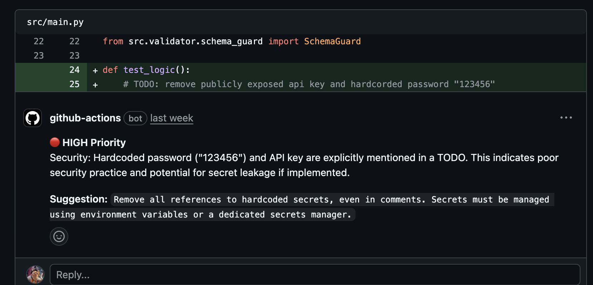
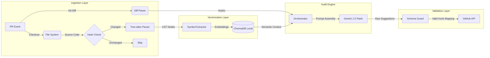

# SentinelPR: Semantic RAG Code Auditor

    [](https://github.com/imrahnf/sentinelpr/pull/6)

**SentinelPR** is a deterministic, context-aware code review agent designed for high-velocity teams. Unlike standard LLM reviewers that operate on isolated Git diffs, SentinelPR leverages a **Retrieval-Augmented Generation (RAG)** architecture combined with **Concrete Syntax Tree (CST)** parsing to provide reviews grounded in project wide context.

It functions not just as a linter, but as a semantic auditor, reading modified functions, retrieving similar architectural patterns from the codebase, and validating suggestions against the actual Git diff hunks to ensure zero hallucinations in feedback.

---

 
## Demo / Transparency

I demoed this project using an open pull request and intentionally left it visible for transparency. You can view the live, in-progress changes, comments, and CI at [PR #6](https://github.com/imrahnf/sentinelpr/pull/6). This PR is a snapshot of work-in-progress and may be updated, merged, or closed over time.

## System Architecture

The pipeline operates as a directed acyclic graph (DAG) of data transformations.



## System Design Decisions

We prioritized deterministic behavior and state persistence over simple probabilistic generation.

| Decision | Traditional Approach | SentinelPR Approach | Justification |
| :--- | :--- | :--- | :--- |
| **Parsing Strategy** | Regex / Text Splitting | **Tree-sitter (CST)** | Regex is fragile. CST ensures we extract full function scopes and understand language semantics. |
| **State Management** | Stateless / External DB | **Local ChromaDB + Cache** | CI/CD is ephemeral. We persist the vector index via `@actions/cache` to enable "Serverless RAG". |
| **Validation** | Probabilistic (LLM) | **Deterministic (Schema Guard)** | LLMs hallucinate. We strictly filter suggestions against Git diff hunks to ensure zero noise. |
| **Context Scope** | Isolated Diff Hunks | **Semantic Neighbors** | Diffs lack context. We retrieve relevant code patterns to ground the review in reality. |

### Stateful RAG in a Stateless Environment
GitHub Actions is ephemeral. Maintaining a vector index usually requires an external service. SentinelPR implements a **Serverless RAG** architecture:
1.  **Vector Store:** We use **ChromaDB** in persistent mode, writing the index to the local filesystem.
2.  **Cache:** Leveraging `@actions/cache`, the vector store state (`.sentinel/db`) and file hashes (`.sentinel/hashes.json`) are persisted between runs.
3.  **Incremental Indexing:** Only files with changed hashes are re-parsed and re-embedded, reducing runtime from minutes to seconds on subsequent runs.

## Pipeline Stages

### 1. Ingestion & Parsing
The system parses the Git diff to identify changed files. Simultaneously, it scans the repository. A hash map of all files is compared against the previous run's state. Only modified files are passed to the Tree-sitter parser to extract top-level symbols (functions, classes).

> ***Note**: SentinelPR implements a "fail fast" logic. If the diff parser detects changes only in non functional areas, such as comments, whitespace, or global vars, the pipeline terminates before the Vectorization stage to prevent unnecessary API overhead.*

### 2. Vectorization
Extracted symbols are embedded using a lightweight transformer model and stored in ChromaDB. This allows the system to query for "code that looks like this" or "functions that handle similar data structures."

### 3. Retrieval & Context Injection
When a diff is analyzed, SentinelPR queries the Vector Store for:
*   **Definition Context:** The full body of the function being modified.
*   **Reference Context:** Other parts of the codebase that call this function.
*   **Pattern Context:** Similar implementations elsewhere in the project.

### 4. Schema Guard (Deterministic Validation)
LLMs hallucinate. They often suggest changes to lines that exist in the file but are not part of the PR's diff context. SentinelPR implements a strict **Schema Guard**:
*   It maps every AI suggestion back to the specific line numbers in the Git Diff Hunk.
*   If a suggestion falls outside the hunk boundaries, it is silently discarded.
*   This guarantees that the bot only comments on lines the developer actually touched.

| Feature | Probability-Based (LLM Only) | SentinelPR (Schema Guard) |
| --- | --- | --- |
| Suggestion Accuracy | May reference any line in the file. | Hard-mapped to PR diff hunks. |
| Noise Level | High (hallucinated line numbers). | Zero (filtered via Git diff metadata). |
| Reliability | "Best effort" generation. | Deterministic validation. |

## Example: Diff Hunk and How SentinelPR Handles It

Given a small Python diff hunk like this:

```diff
diff --git a/src/utils.py b/src/utils.py
index 1234567..abcdef0 100644
--- a/src/utils.py
+++ b/src/utils.py
@@ -10,7 +10,9 @@ def calculate_sum(a, b):
  """
  Calculate the sum of two numbers.
  """
-    return a + b
+    result = a + b
+    log_result(result)
+    return result
```

How SentinelPR processes that hunk (code-backed):

- **Diff parsing (`src/git/diff_parser.py`)**: the repository diff is parsed into `DiffHunk` objects that capture `file_path`, `start_line`, and a list of `changed_lines` (the new-file line numbers for added/modified lines). The example hunk would produce a `DiffHunk` for `src/utils.py` containing the start line from the hunk header and the added line numbers for the three `+` lines.
- **Change detection (`src/indexer/scanner.py`)**: the scanner computes file hashes (`src/indexer/hasher.py`) and only re-processes files whose hashes changed, minimizing unnecessary parsing and embedding.
- **CST parsing (`src/parser/core.py`)**: for modified files, the source is parsed with Tree-sitter into a concrete syntax tree (CST). The parser supports Python and Java via language bindings.
- **Symbol extraction (`src/parser/extractor.py` & `src/models/symbol.py`)**: the extractor walks the CST and extracts complete syntactic units (functions, classes). Each `Symbol` includes `start_line` and `end_line` and the full `content` (so a function body that spans multiple diff hunks is preserved intact).
- **Embedding (`src/ai/embedder.py`)**: extracted symbols are embedded using the configured embedding model (the code uses Google GenAI embedding call `models/text-embedding-004`) to produce vectors for storage.
- **Vector storage & retrieval (`src/storage/vector_store.py`)**: embeddings and metadata (including `file_path` and a `snippet` of code) are persisted to a local ChromaDB collection. These vectors are used to retrieve semantically similar symbols across the codebase for contextual grounding.
- **Hunk-level validation**: because `DiffHunk.changed_lines` gives concrete line numbers and each `Symbol` carries line ranges, the system can map suggestions back to the exact lines in the PR hunk and discard any suggestions that fall outside the touched lines (the README's Schema Guard behavior is implemented by comparing hunk line numbers to symbol ranges).

This example demonstrates how CST-backed symbol extraction prevents fragmentation: the entire `def calculate_sum(...)` symbol (docstring and body) is available for embedding and retrieval even though the diff only touched a few lines inside it. The README text above and these behaviors are implemented in the referenced modules.

## Usage

## Usage

SentinelPR is designed to run as a **composite GitHub Action**.

Create a workflow file at `.github/workflows/sentinel.yml`:

```yaml
name: SentinelPR Audit

on:
  pull_request:
    types: [opened, synchronize]

jobs:
  audit:
    runs-on: ubuntu-latest
    permissions:
      contents: read
      pull-requests: write
    
    steps:
      - name: Checkout Code
        uses: actions/checkout@v4
        with:
          fetch-depth: 0

      - name: Set up Python
        uses: actions/setup-python@v5
        with:
          python-version: '3.11'

      - name: Cache Sentinel State
        uses: actions/cache@v4
        with:
          path: |
            .sentinel/db
            .sentinel/hashes.json
          key: sentinelpr-${{ github.repository }}-${{ github.ref_name }}-v1
          restore-keys: |
            sentinelpr-${{ github.repository }}-${{ github.ref_name }}-
            sentinelpr-

      - name: Generate Diff
        run: git diff origin/${{ github.base_ref }}...HEAD > pr.diff

      - name: Run SentinelPR
        uses: imrahnf/sentinelpr@v1.1.0
        with:
          github_token: ${{ secrets.GITHUB_TOKEN }}
          gemini_api_key: ${{ secrets.GEMINI_API_KEY }}
```

## Technical Constraints & Roadmap

### Current Bottleneck: Atomic API Requests
Currently, the system treats every modified symbol as an **atomic unit of work**, triggering a separate API call to the LLM. While this ensures maximum context granularity, it can lead to rate limiting on **larger pull requests**.

### Roadmap
1.  **Request Batching:** Aggregating multiple small symbol audits into a single LLM context window to reduce API calls.
2.  **Async Processing:** Decoupling the analysis phase from the reporting phase to allow parallel processing of independent file audits.
3.  **Cross-File Reference Graph:** Enhancing the vector store with a graph layer to understand import/export relationships explicitlyand not just semantically.

## Tech Stack

*   **Engine:** Python 3.11
*   **LLM:** Google Gemini Flash
*   **Parser:** Tree-sitter (Python/Java bindings)
*   **Vector Store:** ChromaDB (Persistent Local)
*   **CI/CD:** GitHub Actions

---

Built with ❤️ by [Omrahn Faqiri](https://omrahnfaqiri.com/)
